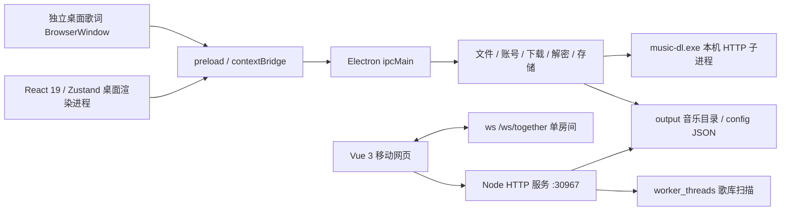

# Wuu 技术实现与协议说明

本文按源码说明运行边界、数据结构、算法、并发控制和验证入口。文档更新日期为 2026-10-07。依赖版本范围来自各层 `package.json`，实际安装版本以对应锁文件为准。功能清单与安装入口见 [README](../README.md)，交互约定见 [播放器体验](player-experience.md)。

桌面歌词的首次状态快照、换句过渡和倍速同步见第 15 节。

## 1. 进程、框架与模块职责



| 层 | 依赖范围或原生 API | 实际职责与代码入口 |
| --- | --- | --- |
| 桌面宿主 | Electron `^33.0.0`、Node.js CommonJS | [main.js](../main.js) 装配模块、注册 `music://`、管理退出；不是前端路由入口 |
| 新版桌面 | React / react-dom `^19.0.0`、Zustand `^5.0.0` | [main.tsx](../desktop_UI/src/main.tsx)、[store.ts](../desktop_UI/src/store.ts)；UI、用户状态和播放器快照 |
| 桌面工具链 | TypeScript `^5.9.0`、Vite `^7.0.0`、Vitest `^3.2.0`、Playwright `^1.63.0` | 严格类型检查、静态构建、单元验证和真实 Electron 验证 |
| 移动网页 | Vue `^3.4.0`、Vite `^5.0.0` | [mobile_UI/src](../mobile_UI/src)；通过 HTTP 和 WS 获取资源、播放状态，使用手机自身音频元素播放 |
| 网络服务 | Node `http`、`ws ^8.21.3` | [server/index.js](../server/index.js) 手工分派路由、Range、访问控制及一起听；根依赖包含 Express，但此服务不是 Express 路由 |
| 音频 / 图片 | Web Audio、`music-metadata ^7.5.3`、`jpeg-js ^0.4.4`、Electron `nativeImage` | 效果链、音频标签、音频结构校验、封面像素取色 |
| 账号 / 密码学 | Node `crypto`、`sql.js ^1.12.0`、`node-forge ^1.3.1` | AES、哈希、客户端 Cookie 数据库读取及平台凭证处理；应用设置以 JSON 保存 |
| 打包 | electron-builder `^25.0.0` | Windows NSIS / 目录包、ASAR、原生签名模块解包 |

主进程功能模块在 `require()` 时注册 IPC。跨模块窗口引用集中在 [core/state.js](../core/state.js)，`sendToMain` / `sendToLyric` 先检查窗口是否销毁。`before-quit` 停止本机服务、HTTP/WS、桌面歌词窗口及托盘；主窗口关闭按钮走隐藏到托盘的流程。

本次核对的锁文件解析版本为：Electron 33.4.11、electron-builder 25.1.8；桌面 React/react-dom 19.3.0、Zustand 5.0.15、TypeScript 5.9.3、Vite 7.3.6、Vitest 3.2.7、Playwright 1.63.0；移动 Vue 3.5.41、Vite 5.4.21。锁文件与 manifest 的兼容范围是两种信息，升级依赖后应同步核对。

根运行依赖中的其他技术各有明确位置：Axios、CryptoJS 和 node-forge 用于内嵌平台 HTTP 与请求密码学；qrcode 生成平台登录二维码；md5 用于平台上传等校验；xml2js 解析网易 voice upload XML；Express、express-fileupload、safe-decode-uri-component 支持内嵌 API 的独立服务入口；pac-proxy-agent/tunnel 支持该 API 的代理选项。yargs 是已声明的 CLI 依赖，不应据此宣称桌面 UI 新增功能。不能将内嵌库的全部接口都写成 Wuu 已提供的界面功能。

### 1.1 新旧界面入口

[window/renderer-entry.js](../window/renderer-entry.js) 按 `settings.interfaceMode` 选择入口：

- `modern`：生产加载 `desktop_UI/dist/index.html`；开发在非打包模式下使用 `WUU_RENDERER_URL`，通常为 `http://127.0.0.1:5173/`。
- `classic`：主窗口加载 `renderer/index.html`，歌词窗口加载 `renderer/desktop-lyric.html`，开发时也直接加载旧文件。
- 新版主窗口和歌词窗口共用 React 产物，以 `?window=lyrics` 区分；界面切换还传递暂停状态和歌词窗口状态。

两套资源均在打包清单内。切换前保存共用用户数据和本地播放会话，再重载窗口；`renderer/` 仍是可运行的旧版入口。

### 1.2 Electron 桥接与实际边界

[preload.js](../preload.js) 通过 `contextBridge.exposeInMainWorld` 暴露业务 API；渲染层 [api.ts](../desktop_UI/src/api.ts) 包装 bridge、路径 URL 与订阅。请求结果通过 `ipcRenderer.invoke` 返回；单向控制用 `send`；退出保存用同步 IPC。事件包装保存具体 listener，并返回取消订阅函数，组件卸载时移除自己的监听。

主窗口设置 `contextIsolation: true`、`nodeIntegration: false`，React 不直接导入 Node 文件系统。当前主窗口同时设置 `webSecurity: false`，`music://` 声明 `bypassCSP` 和 CORS 权限；IPC 没有统一运行时参数 schema，文件协议也没有目录白名单。因此这些设置不能等同于完整的文件访问沙箱。业务参数、来源和路径校验以各 handler 的实际代码为准。

## 2. 歌库扫描、标签与音频时长

### 2.1 文件布局和歌曲身份

`output/<歌曲名 - 艺人>/` 存放音频、`cover.jpg/png/webp`、LRC、`lyrics_raw.txt`、可选 `lyrics_krc.json` 和 `info.json`。扫描支持 `.aac/.m4a/.mp3/.wav/.flac/.ogg`，排除名称含 `.enc.` 的未解密文件。

[audio/scanner.js](../audio/scanner.js) 的 `scanMusicFiles` 优先读 `info.json.title`，兼容旧 `songName`；艺人缺失时按文件名最后一个 ` - ` 拆分，避免误拆包含分隔符的歌名。署名缺失时只检查 LRC 前 50 行的词曲 tag。`info.duration` 从毫秒换为秒；UI `Song.realDuration`、播放器进度和歌词时间均使用秒。

`audioPath` 是收藏、统计、进度、历史及手工曲风的关联键。扫描返回的数组位置和 `id` 不应当作永久身份；刷新、重命名或删除会改变位置。修复重命名需要一起迁移路径引用。

### 2.2 两种扫描路径与后台补齐

- 桌面 `get-songs`：同步扫描目录、现有信息和已缓存标签，先返回可播放列表；`setImmediate` 启动曲风补齐，300ms 后启动时长补齐。基础扫描本身仍在主进程执行。
- HTTP 歌库：使用 [server/scanner-worker.js](../server/scanner-worker.js) 的 `worker_threads` 扫描，将结果缓存用于分页；Worker 错误后的处理由 [server/index.js](../server/index.js) 决定。
- 曲风来自 [audio/genres.js](../audio/genres.js) 的音频标签解析和缓存，更新按 `audioPath` 发送 `song-metadata-update`。当前歌库路径集合过滤迟到结果，避免已删歌曲回流。
- [store.ts](../desktop_UI/src/store.ts) 先缓存可能早于歌曲列表到达的标签，再以 50ms 短批次更新现有歌曲及当前歌曲对象；不会重建音频源，手工 `genreOverrides` 优先于自动标签。

时长解析通过 `setImmediate` 在歌曲之间让出事件循环，每 10 首写缓存并发送 `duration-update {idx, duration}`。这是分批执行，不是所有音频解析都在 Worker 内完成；单首同步解析仍占用其所在进程。

### 2.3 时长算法和估算边界

入口名虽为 `getAACDuration`，实际依次探测 FLAC、MP3、AAC，依据文件头而非扩展名：

| 格式 | 算法 | 精度边界 |
| --- | --- | --- |
| FLAC | 读取 `fLaC` 与 STREAMINFO，提取 20 位采样率和 36 位总采样数；`duration = totalSamples / sampleRate` | 依赖 STREAMINFO 完整且字段有效 |
| MP3 | 跳过 ID3，识别 MPEG 版本、Layer、码率、采样率、padding，遍历帧累计样本数 | 不能据此保证所有损坏或特殊封装都可解析 |
| AAC ADTS ≤10MiB | 找 `0xFFF` 同步字，解析帧长度和采样率，完整计数；`duration = frameCount * 1024 / sampleRate` | 当前模型按每帧 1024 个样本计算 |
| AAC ADTS >10MiB | 前、中、后各读 64KiB，求平均帧长，估算总帧数 | 对帧长变化大的文件属于估值，不是完整逐帧精确计时 |

[core/storage.js](../core/storage.js) 的时长缓存为 `{audioPath: {mtime, duration}}`，mtime 偏差小于 1 秒视为命中；低于或等于 30 秒且文件大于 1MiB 的缓存会被视作可疑。播放器另用 [playbackUtils.ts](../desktop_UI/src/services/playbackUtils.ts) 选择可用时长并限制 seek 位置，避免浏览器无效估值污染进度。

## 3. 启动、状态合并与数据持久化

### 3.1 先可播放，再完整加载

Zustand `initialize()` 复用进行中的 Promise，并用请求版本隔离重试。歌曲和用户数据立即并发读取；基础歌曲不等待迟到用户数据或全库标签。用户偏好已到达时与歌曲一起发布，减少默认外观闪烁。

`hydrated` 表示原用户数据加载成功。此之前 `persistNow()` 不写盘，`applyUserDataChange()` 将早期设置、收藏、曲风和播放变更同时应用于当前 UI，并加入 `pendingChanges`。加载原数据后按顺序重放这些函数，防止默认空状态覆盖磁盘，也防止迟到恢复覆盖用户刚做的操作。播放器再用初始化生命周期和播放请求版本判断自动恢复是否仍有效。

### 3.2 JSON 字段和兼容迁移

`config/userdata.json` 保存以下应用级字段：

| 字段 | 结构和用途 |
| --- | --- |
| `collections` | `{id, name, songs: audioPath[], createdAt}[]`，歌单歌曲按路径关联 |
| `likes` / `dislikes` | `{path, ts}[]`；读取兼容旧字符串喜欢列表，渲染层使用映射加速查询 |
| `progress` / `actualDuration` | `Record<audioPath, seconds>`，进度与确认时长 |
| `lastSession` | `{audioPath, t}`，上次本地歌曲和秒级进度 |
| `stats` | 按路径保存累计播放数、实际聆听秒数、`recentDays` |
| `genreOverrides` | 按路径保存手工曲风，不改写音频标签 |
| `settings` | 界面、歌词、音效、网络和新版/旧版偏好 |

旧 localStorage 喜欢数据仅在成功写盘后移除。渲染层序列化保留接收到的额外数据，但主进程 `writeUserData` 仍只输出其列出的应用级字段；不能宣称任意未知顶层字段都能长期保存。

### 3.3 写入、缓存与恢复

- UI `scheduleSave()` 将变更合并到一个 500ms 保存定时器；播放进度另外节流保存，退出执行同步保存。
- `userdata.json` 写入先生成同目录 `.tmp`，再 `renameSync` 替换；失败清理临时文件并返回 `false`。未显式执行 `fsync`，因此不能承诺断电时的完整持久性。
- 读取缓存键为 `mtimeMs:size`，本进程写入立即失效；JSON 解析失败复制为 `userdata.json.corrupt-<timestamp>` 后返回默认结构。
- `duration_cache.json`、`free_music.json`、`play_failed.json` 使用直接 JSON 写入，不能把 userdata 的原子替换机制推广到全部配置文件。
- 账号配置、音乐、测试产物和本地备份受 `.gitignore` 排除。`sql.js` 用于读取汽水客户端 Cookie SQLite 数据库，应用设置未迁移到 `data/settings.db`。

### 3.4 实际聆听统计

[listeningHistory.ts](../desktop_UI/src/services/listeningHistory.ts) 分别处理播放次数和实际聆听秒数。只接受有限且 `0 < seconds <= 5` 的单次时长片段，跨午夜按本地日历切分，`recentDays` 保留最近 90 天。旧数据保留累计值，不补造历史日期。[listeningStyles.ts](../desktop_UI/src/services/listeningStyles.ts) 计算近期 7/30 天曲风分布，多标签平分时长，包含未标注部分；隐藏统计页停止订阅。

## 4. 播放器生命周期、竞态与队列

[player.ts](../desktop_UI/src/services/player.ts) 导出单例 `playerService`。媒体元素、AudioContext、效果链和队列由服务持有，不随 React 页面卸载重建。状态快照进入 store，视图只订阅需要的数据。

1. 每次本地选歌、在线试听或队列切换推进播放请求版本；歌词读取、音源解析、封面取色等异步结果只在版本仍有效时落地。
2. 恢复进度先保存在请求中，等 `loadedmetadata` 后按安全时长 seek；后来的手工选歌通过播放版本阻止旧启动恢复。
3. 实际开始播放后记录历史；失败或过期的解析不进入已听历史。洗牌顺序是未来播放计划，历史另存，跨洗牌轮与切模式保留。
4. 随机模式“上一首”沿成功播放历史返回，回退后的“下一首”先走原历史再抽新歌；按路径跳过已删或不推荐歌曲。顺序及歌单模式保留首尾循环。
5. 试听历史保存真实来源与队列上下文，返回时复用已成功试听对象；只有无可用 URL 且存在 resolver 的目标才重新解析。失败保留当前状态，旧请求不得覆盖新目标。
6. 媒体错误计数防止全坏队列无限循环，并通过 `report-play-failed` 将本地失败交给修复中心。

Web Audio 在可用时接管声音；构建效果链失败回退到媒体源直连增益。可选淡出暂停在 500ms 内降低增益，再暂停媒体，不以页面动画结束作为播放业务事件。MediaSession 元数据及控制与当前有效歌曲同步。

服务实际持有一个 `<video>` 元素，供音频和视频共用；播放进度每 2 秒保存，普通桌面状态同步按 3 秒节流。播放次数在切新音源和单曲循环时递增，可能先于成功播放；已听历史在 `playing` 事件记录，不能将这两个指标混为一谈。

## 5. Web Audio 数字音效

[audioFx.ts](../desktop_UI/src/services/audioFx.ts) 的 `AudioEffects` 持有节点并提供 `apply` / `dispose`：

```text
MediaElementAudioSource → 显式双声道 Gain → highpass → 10×peaking
 → lowshelf(90Hz) → highshelf(12kHz) → splitter → M/S 重建
 → StereoPanner ┬→ 输出增益 → destination
                └→ Convolver → wet Gain → 输出增益
Oscillator(sine) → depth Gain → StereoPanner.pan
```

- M/S：`M=(L+R)/2`，`S=(L-R)/2`，输出 `L'=M+wS`、`R'=M-wS`；`w=1` 恢复输入，增大 `w` 扩大 Side 分量。单声道先按 speakers 模式升混，避免 splitter 只送一侧。
- 10 段中心频率默认 `31,62,125,250,500,1000,2000,4000,8000,16000Hz`；增益 `[-12,12]dB`，自定义频率 `[20,20000]Hz`、Q `[0.1,6]`。
- LFO 正弦输出经 depth 增益控制声像，不包含头部追踪或空间位置建模。
- 双声道 IR 长度 `sampleRate*1.9`，随机噪声乘 `(1-i/length)^2.6` 衰减；dry 分支保持直连，wet 为额外叠加，不是 `dry=1-wet` 的等功率混合。
- 参数用 `setTargetAtTime(value, currentTime, 0.03)` 平滑；`dispose()` 停止 LFO 并断开节点。
- `normalizeFxSettings` 钳制有限值、补齐十段参数；9 个预设及命名方案保存在 `settings.audioFx`。`off` 仍经过 HP 20Hz 和节点链，不能称为严格数字 bit-perfect bypass。

## 6. 歌词格式、焦点与跨窗口时钟

### 6.1 解析后的统一结构

[lyrics.ts](../desktop_UI/src/services/lyrics.ts) 的解析优先级为 RAW/KRC 文本 → 增强 LRC → 普通 LRC → 无时间正文 / 占位文本。格式及内部单位如下：

```ts
// RAW: [行起始毫秒,行时长毫秒]<字偏移毫秒,字时长毫秒,标记>文字
interface WordLyricLine {
  start: number; duration: number; // 秒
  chars: {offset: number; dur: number; text: string}[]; // 相对行起点，秒
}
interface PlainLyricLine {time: number; text: string} // 绝对秒
```

解析器清除前导元数据、应用 LRC `offset`、识别双语行和多重时间戳，将词曲署名从正文中提取。RAW 还限制异常单字时长至 0.8 秒，对超过 2 秒的字间异常空洞做衔接处理；这是展示防护，保留原声明的行时长。活动行使用已排序时间的二分查找。

[lyricPresentation.ts](../desktop_UI/src/services/lyricPresentation.ts) 将同时间戳原文和译文作为一组；焦点由下一组时间决定，不因逐字填充结束或声明时长结束提前缩回。末组直到换歌仍突出。逐字填充为 `clamp((time-start-offset)/dur,0,1)`，焦点与填充计算分开。

### 6.2 主窗口和桌面歌词

主歌词视图读取媒体时间，通过 `requestAnimationFrame` 更新逐字展示；手工滚动暂缓自动跟随，点击行调用 seek。减少动态时仍计算时间和填充，只取消装饰性位移/旋转。

桌面歌词通过 preload 接收歌曲、歌词结构、设置、颜色及时间消息。主播放器约每 200ms 发送一次时间锚点；独立窗口利用锚点、本地单调时间和实际 playbackRate 估算两次 IPC 之间的进度，暂停、跳转和新锚点重新校准。更新帧率受实际显示和浏览器调度影响，不能保证固定 60fps。

已提交窗口的外推公式为 `lastTime + (playing ? (performance.now()-lastWall)/1000 : 0)`。长句溢出滚动根据已填充宽度与可见宽度推导目标，按 `1-exp(-dt*12)` 平滑趋近，`dt` 上限 0.05 秒；ResizeObserver 观察固定容器，不逐帧重新测量布局。主进程缓存各消息 type 的最后值，加载完成及 `requestState` 时回放，并校验请求来自实际歌词窗口。

[window/desktop-lyric.js](../window/desktop-lyric.js) 创建透明置顶、`skipTaskbar` 窗口。锁定用 `setIgnoreMouseEvents(true,{forward:true})`，锁定与开关在软件内控制。窗口位置与锁定偏好保存；晚开窗口在订阅后请求当前播放状态。

## 7. 封面像素算法与异步图片生命周期

[cover/color.js](../cover/color.js) 统一从 Buffer 取色：JPEG 用 `jpeg-js` 得到 RGBA，其他格式走 `nativeImage`，将小端平台 BGRA 转为 RGBA，采样缩放至 `48×48`。

1. 跳过 alpha `<128`、近黑或近白亮度区间（`(max+min)/2 <8` 或 `>248`）。
2. RGB 转 HSL；饱和度 `<0.1` 进入灰度桶，其余按色相分 12 个 30° 扇区。
3. 桶内取平均 RGB；灰度桶强制三通道相等。
4. 返回所有非空桶 `{r,g,b,weight}`，`weight=count/有效像素数`，按占比降序；不是仅返回一个颜色，也没有乘亮度因子的权重。

[coverPalette.ts](../desktop_UI/src/services/coverPalette.ts) 接受桶数组或 RGB，按 sRGB 线性亮度计算对比度，以 16 次二分调整暗色强调色/亮面文字色达到 4.5 的目标。[RecordArtwork.tsx](../desktop_UI/src/components/RecordArtwork.tsx) 在 [Cover.tsx](../desktop_UI/src/components/Cover.tsx) 的 onLoad 回调后交接新旧封面层；Cover 以路径和请求标识丢弃迟到结果，失败 1200ms 后自动重试一次，之后等待 focus/online/pageshow/visibility/Intersection 等事件。最多 128 条图片成功版本记录唤醒同源失败缩略图，并限制回流避免循环。图片加载与提色是两个异步流程，主题是否扩展到全局由 `themeFollowCover` 决定，歌词配色独立保留。

## 8. 本地文件协议与网络资源

### 8.1 `music://`

[api.ts](../desktop_UI/src/api.ts) 将本地路径编码为媒体 URL；[main.js](../main.js) 在 `app.whenReady()` 后使用 `protocol.handle('music', ...)`，解析路径、异步 stat、按扩展名选择 MIME，并返回 Fetch `Response`。

- 无 Range：`fs.promises.readFile` 读整个文件至 Buffer；会占用与文件大小相应的内存。
- `bytes=start-end` 或 `bytes=start-`：open/read 读取目标区间，返回 `206`、`Content-Range`、`Content-Length`、`Accept-Ranges` 和 CORS 头。
- 越界起点返回 `416`；不存在返回 `404`，读取异常 `500`。
- 当前正则解析单一区间；suffix `bytes=-N` 未按 RFC 尾部区间处理，多区间也未实现。不能将其描述为完整通用 HTTP Range 实现。

网络 HTTP 音频路由使用 `fs.createReadStream`，与此 Buffer 协议不同。文件协议解决项目本地路径读取与媒体访问需求，不是对所有 Windows 长路径和浏览器格式的兼容保证。

### 8.2 手机与分享 HTTP 路由

`serverEnabled` 或 `mobileEnabled` 开启时启动同一 Node HTTP 服务，默认端口 `30967`、绑定 `0.0.0.0`，默认两个开关均关闭。Vite 手机开发端口 `5174` 代理 API 到该服务。

| 路由组 | 方法与关键数据 | 用途 |
| --- | --- | --- |
| `/api/songs?page=&pageSize=&q=`、`/api/refresh`、`/api/random` | GET，缓存歌库分页/刷新/抽样 | 手机列表和首播 |
| `/api/stream/:index`、`/api/stream-by-path?path=` | GET，支持单区间 Range | 播放与按路径桌面同步 |
| `/api/cover/:index`、`/api/cover-by-path?path=`、`/api/lyric/:index` | GET | 图片与歌词 |
| `/api/state`、`/api/sync-mode` | GET；sync-mode 亦接受 POST `{mode}` | 桌面状态快照，`merged`/`isolated` 模式 |
| `/api/collections`、`/api/collections/create` | GET / POST `{name}` | 共用歌单 |
| `/api/like`、`/api/like-collection`、`/api/dislike` | POST 歌曲索引、歌单 ID 和增删信息 | 手机收藏与不推荐 |
| `/api/play-count`、`/api/progress`、`/api/progress/:index` | POST / GET，秒级 time | 次数、进度上报和恢复 |
| `/api/audio-fx-presets` | GET | 桌面保存的自定义音效方案 |
| `/playlist/:id`、`/stream/:id/:index`、`/cover/:id/:index`、`/lyric/:id/:index` | GET，`?k=accessKey` | 分享歌单及其资源 |

访问控制包含 IP 白名单、按 IP 60 秒窗口限频、本机放行和最多 500 条日志；WS 升级复用白名单，不等于 HTTP 请求限频也覆盖每条 WS 消息。空白名单允许所有；移动 `/api/*` 没有与分享相同的 accessKey 验证。服务没有内置 TLS，代理来源处理会采用 `X-Forwarded-For`，部署边界以代码和网络配置为准。

## 9. 移动播放与一起听

[mobile_UI/src/composables/usePlayer.js](../mobile_UI/src/composables/usePlayer.js) 管理手机音频、历史、歌词、桌面同步和 MediaSession。HTTP 状态同步与一起听 WS 分别处理不同场景：桌面状态来自 `/api/state`；一起听是移动网页之间的单房间操作广播。

手机首次同步将目标进度保存到音频元数据就绪后再 seek，首次进入仍由用户操作触发播放。歌词文本到达、暂停和跳转立即校准；活动行与逐字填充使用同一时钟，隐藏、暂停、卸载时停止逐帧更新。每次切歌隔离歌词、音源及历史进度请求，手工跳转优先于迟到恢复。历史按路径定位当前数组，避免删除后索引复用。

桌面状态在手机启动时同步一次，不是持续轮询镜像。手机每 3 秒检查进度，变化达到 5 秒才上报；恢复已有进度要求超过 5 秒且距离结尾超过 5 秒。`songRequest/navigationRequest/seekRevision` 分别隔离切歌、前后导航与 seek 恢复。

MediaSession 提供元数据、封面、play/pause、上一首/下一首、seekto、stop；`setPositionState` 更新系统进度。能力与显示取决于浏览器及操作系统。当前未配置离线 service worker 和 PWA manifest，不能将普通主屏书签描述成已实现离线 PWA。

手机 [useAudioFx.js](../mobile_UI/src/composables/useAudioFx.js) 同样实现高通、十段 EQ、低高 shelf、M/S 宽度、声像 LFO 和卷积混响；IR 为 1.2 秒，区别于桌面 1.9 秒。手机音效选择/方案存 localStorage，桌面命名方案从 HTTP 读取；当前音效选择没有跨端实时同步。手机歌词字号也存本地偏好，普通字号 16–36px，当前行最高 60px。

手机 M/S 节点的实际 Side 支路增益为 `L/2-R/4`，与桌面 `(L-R)/2` 不同；相同预设名称不表示矩阵或声音完全一致。

### 9.1 WS 消息与仲裁

服务使用 `ws` 的 `noServer` 模式，在同一 HTTP 端口升级 `/ws/together`：

```json
{"type":"op","op":"seek","payload":{"songId":12,"position":42.5}}
```

| 方向 | 消息 | 处理 |
| --- | --- | --- |
| 客户端 → 服务 | `op`：`song/play/pause/seek/state` 和 payload | 服务分配递增 seq、ts、from，转发给其他成员 |
| 服务 → 新成员 | `welcome {id, peers, hostId, hostSong, lastOp}` | 加入及重连用当前歌曲、进度和播放态追平 |
| 服务 → 成员 | `op {seq, op, payload, ts, from}` | 客户端丢弃过期 seq，避免乱序回退 |
| 服务 → 成员 | `peers` / `peer-left` | 更新人数与 host；退出后剩余成员暂停 |

host 是在线 ID 最小者；两方均可切歌，但仅 host 周期 `state` 校准和自然播完后自动切下一首，减少竞争。[mergeTogetherState](../server/together-state.js) 将控制合并到 welcome 快照，并拒绝不匹配当前歌曲的定位更新。房间清空即清理歌曲和最近操作；连接层每 30 秒发送 ping，但当前代码没有基于 pong 超时的完整僵尸连接回收。

[useListenTogether.js](../mobile_UI/src/composables/useListenTogether.js) 重连退避为 `min(15000,1000*2^attempt)` 毫秒，重新连接后重置已应用序号。远端操作标志与约 800ms 媒体事件抑制窗避免回声。播放中每 5 秒发送 state，接收端只采用 host 校准，以远端进度加 0.15 秒固定估计作为目标：偏差绝对值 `>0.4` 秒直接 seek，`>0.12` 秒用 `1.02/0.98` 播放速率微调，否则回到 1。未测 RTT，也没有服务器时钟同步。非 host 自然结束后等待 5 秒仍未切歌时可本地继续。

实际还广播 `like` 收藏操作，服务端目前没有完整 op 白名单。房间全局唯一、状态仅在内存，没有账户认证、多房间 ID 或跨重启恢复。

这里同步控制和播放位置，各端仍独立加载与解码媒体；不是音频帧广播，也不是样本级同步。

## 10. 平台解析、账号、下载与本机服务

### 10.1 解析器契约

[parsers/base.js](../parsers/base.js) 定义能力声明与统一歌曲结构 `{id,source,name,artist,album,cover,duration,bitrate,ext,link,extra,...}`。未覆盖方法抛出“不支持”；能力声明不意味着所有平台均支持所有功能。

[parsers/index.js](../parsers/index.js) 按 HTTPS 链接域名检测 → 遍历 `canParse` → 汽水兼容回退选择解析器，当前注册汽水、网易、QQ、酷我、咪咕、Bilibili、5sing、千千、Jamendo、JOOX、Apple。酷狗走独立导入模块。注册中心目前保留分享链接解析；免费听的搜索、音源和换源主要由 `music-dl.exe` 接管。

### 10.2 账号与上游适配

| 模块 | 具体技术 | 运行依赖 |
| --- | --- | --- |
| `netease/` + `tools/netease-api/` | 本地复用平台 API 实现、二维码/Cookie、多账号配置与歌单拉取 | 平台接口、账号会话和内容权限 |
| `kugou/` + `vendor/kugoumusicapi/` | vendored npm file 依赖、二维码/验证码、token 刷新及启动补丁 | 根 postinstall 和上游登录状态 |
| `qishui/` + `parsers/qishui-decrypt/` | Cookie/CSRF、track_v2、音质选择、本机客户端凭证读取 | 账号权限、设备配置及可选原生签名模块 |
| `sodamusic-cookie.js` | 缓存初始化的 sql.js WASM，读取客户端 SQLite Cookie 数据 | 已存在的本机客户端数据库；不是 Wuu 设置数据库 |

配置中的 Cookie 和 token 是本地账号凭证，JSON 持久化没有统一加密封装。纯本地存储不能解释为所有请求都不经过第三方；各平台适配器的 endpoint 和代理设置决定实际数据流。

账号配置分别为酷狗 `kugou_config.json`（Cookie 对象）、网易 `netease_config.json`（Cookie 字符串）、汽水 `qishui_config.json`（完整 Cookie/sessionid），包含多用户与当前账号；`parsers/auth/cookie-manager.js` 是独立的内存 Cookie 容器。酷狗 token 刷新缓存约 1 小时，设备注册失败有重试节流；汽水二维码创建/轮询复用下发 CSRF Cookie，确认后保存完整会话。

### 10.3 平台请求密码学与代理

[netease-crypto.js](../parsers/platforms/netease-crypto.js) 和内嵌 API [util/crypto.js](../tools/netease-api/util/crypto.js) 包含协议兼容密码学：weapi 将 JSON 经固定 key/IV 与随机 16 字符 key 两层 AES-128-CBC，反转临时 key 后 RSA 编码为 `encSecKey`；eapi 将路径、正文和 MD5 摘要拼接后 AES-128-ECB 编码，linuxapi 使用独立固定 key 的 ECB。内嵌库还处理部分响应解密/解压。这里的固定参数和 MD5 用于适配上游协议，不是 Wuu 歌单分享采用的密码方案。

酷狗库读取 `KUGOU_API_PROXY` 的 HTTP/HTTPS 地址，支持认证与缓存解析；网易库接受调用的 `options.proxy` 并可走 PAC 或 tunnel，未传时显式关闭 Axios 代理。当前网易 IPC 调用未传递统一代理偏好，依赖代理库不等于已经提供全应用代理设置。

### 10.4 下载和缓存复用

[download/index.js](../download/index.js) 编排链接解析、音频下载、可选解密、封面/歌词和 info 写入；文件名通过 `sanitizeFileName` 替换 Windows 非法字符并清理尾部点与空格，实际格式优先按音频魔数判断，避免依赖错误 Content-Type。

标准下载把音频完整读到 Buffer；未加密音频按魔数/Content-Type 判别格式，Soda 解密成功保存 `.m4a`，失败保存 `.enc.m4a`。覆盖选项分别控制音频、封面、LRC、info 和 KRC；阶段回调是文件阶段完成进度，不是字节流下载进度。批量链接逐首 await，完成后间隔 500ms，吞吐量不固定。已有音频/封面的“相同”检测主要是大小阈值，歌词可比正文、info 比核心字段、KRC 比句数，没有全文件哈希去重。

汽水保存前查找系统临时目录 `qishui-preview-<trackId>.{m4a,flac,mp3,mp4}`，文件大于 1024 字节可复用试听缓存，未命中才下载。缓存命中属于避免重复下载，不等于已验证内容权限或全文件解码正确。

[free-music/service.js](../free-music/service.js) 以 `windowsHide:true` 启动 `music-dl.exe web --port 17324 --no-browser --desktop` 本机子进程，IPC 通过 `http://127.0.0.1:17324` 访问；监听地址由二进制实现决定。日志过滤请求噪声，退出结束子进程。[free-music/ipc.js](../free-music/ipc.js) 提供搜索、解析、试听、歌词及保存的业务桥接。二进制缺失或启动失败时该专区不可用，不影响本地音乐播放。

该子进程以 stdout 的 `Web started at` 判断就绪，没有自动重启。部分搜索/详情响应由 IPC 解析 exe 输出的 HTML，依赖模板结构；专区保存是独立管线，扩展名主要按 Content-Type，不能把标准下载的魔数检测、Soda 解密和 KRC 保存能力自动套用到它。

[core/network.js](../core/network.js) 的 `fetchWithTimeout` 用 AbortController 限制等待响应；当前 `fetch()` 返回后即清理计时器，调用方继续读取 body 时不再受此 timer 保护，不能声称这里保证整个下载 body 的总超时。

单首标准下载及酷狗/网易导入 IPC 外层的 60 秒 `Promise.race` 可以让 IPC 返回超时，但不会取消仍在运行的底层下载/写入。各导入音质回退列表与权限判断也不相同，不能将获得任意 URL 等同于取得指定完整音质。

### 10.5 新曲发现排重

[netease/discovery.js](../netease/discovery.js) 与 [discovery.ts](../desktop_UI/src/services/discovery.ts) 从公开歌单抽取候选，按平台 ID 和规范化歌名/共享艺人排除本地与会话已展示歌曲；换批优先消耗未展示候选，再轮换分类和目录页。网络失败保留上一批；试听只接受最后请求，保存后移出候选。公开歌单采样不是全网均匀随机或模型个性化推荐。

## 11. 汽水样本解密和文件修复

### 11.1 两条解密实现

[soda/decrypt.js](../soda/decrypt.js) 的通用路径从 `playAuth` 提取 Spade key，用 `aes-128-ctr` 按样本解密；解析 `moov/trak/mdia/minf/stbl/stsz/senc/mdat`，校验样本数与 IV 数，8 字节 IV 扩展到 16 字节。输出将 `enca` 改为 `mp4a`，将相关加密 metadata box 类型改为 `free`，保留字节长度和父 box 布局。

[TrackDecryptor](../parsers/qishui-decrypt/track-decryptor.js) 支持直接十六进制或 Spade 编码密钥，并利用 `stsc` 的 chunk 样本分布和 `stco` 文件偏移重建每个样本位置。按该偏移解密再原位写回，避免将 chunk 前的额外 box 当作音频；无 chunk offset 时回退顺序布局。若容器携带 FLAC metadata，则生成 `fLaC + metadata + 解密样本`，否则还原 M4A。不能把顺序布局的旧路径描述为支持任意 MP4/CENC 文件。

签名适配 [bdms-signer.js](../parsers/qishui-decrypt/bdms-signer.js) 尝试从 native 或 `app.asar.unpacked` 加载 `bdms.node`/相关 DLL，生成 track_v2 所需请求头；设备信息保存在本地。专有二进制不随 Git 提交，签名或音质获取结果依赖本机环境和平台授权，不能保证缺少文件的克隆仓库也具备完整签名能力。

### 11.2 校验与修复闭环

[verifyAudioFile](../audio/verify.js) 先检查文件至少 10KiB；非 MP4 类只按大小判断。MP4 类递归扫描 box，检查 `enca`、`mdat`，从最多 20 个样本首字节估计一致率，低于 0.5 判异常。这是启发式结构检测，既不是完整解码也不是密码学完整性校验。

[repair/index.js](../repair/index.js) 合并文件问题和 `play_failed.json` 的播放器实际错误，自动音频修复按 trackId 调用分享解析器 [qishui.js](../parsers/platforms/qishui.js) 的 `fetchTrackV2`，依赖其外部 HTTP 解析后端；并非按 source 通用重取，也不复用账号导入的完整签名回退链。歌词从 KRC JSON 重建或请求手工链接，纯音乐/至多两行 LRC 不直接报歌词损坏。名称修复读取真实标签，重命名目录/音频/LRC并更新 info。修复/删除后清失败记录，渲染层迁移音频路径关联。非平台可重取资源、不可用账号或缺少源 ID 的情况不能自动承诺修复。

## 12. `wuu://` 分享格式与访问计数

[playlist/share.js](../playlist/share.js) 将歌单记录写入 `config/shared/`，生成两种不同秘密：用户分享密钥和随机 16 字节（32 hex）HTTP `accessKey`。

```text
wuu://base64url(JSON{v,f,b,j,jc,r,dt,d,p})
d = JSON{iv,ct,tag}
AES key = SHA256(用户分享密钥)
plaintext = JSON{id,k:accessKey,h:host或混淆IP}
iv = randomBytes(12)
ct = AES-256-GCM密文再与循环iv做XOR，字段用base64url
p = 格式头+字母映射的端口混淆
```

GCM 认证的是加密 payload，端口 `p` 和外层兼容字段不在此认证范围；XOR 与字母映射是混淆层，不能视作增加独立密码学保护。正确密钥解码后取得 host、port、id 和 accessKey，再经明文 HTTP 拉取资源；这里加密的是分享链接内容，不是 HTTP 音频传输。

`/playlist/:id?k=` 校验访问 key、到期与访问次数并递增 `usedCount`；stream/cover/lyric 属于同次取歌单后的资源请求，不递增次数。访问上限不是每个音频文件的下载次数。

`.crt` 当前导出自定义 `BEGIN WUU KEY` 的 PEM 风格文本，并兼容历史二进制导入；不是 X.509 证书，也不进行 TLS 证书验证。文件可同时包含链接和密钥，是否分开传递由使用方式决定。

## 13. 界面性能、动效与可访问性

[App.tsx](../desktop_UI/src/App.tsx) 用 React lazy/Suspense 按功能加载，已访问页面保留实例，隐藏时按功能停止不必要订阅；[LibraryView.tsx](../desktop_UI/src/features/LibraryView.tsx) 使用 64px 行步长虚拟渲染，可见区前后各加 5 行缓冲，而非一次创建全库 DOM。

页面过渡通过 View Transition API 捕获内容宿主，玻璃背景和常驻底栏持续更新；同源已加载矩形封面才参加共享过渡。页面约 320ms、封面约 620ms，浏览器不支持时走备用动画。新导航取消旧过渡，隐藏窗口或 `prefers-reduced-motion` 直接落到最终状态。

弹层、导航标记、滚动条保留组件/DOM 实例，通过 CSS 过渡使反向操作从当前视觉位置接续；业务提交不依赖 animationend。键盘焦点、可访问按钮名称、菜单方向键/Escape、侧栏拖动的键盘替代，以及歌词最大字号换行由组件层处理。具体 CSS 与事件映射见 [UI_DESIGN](UI_DESIGN.md)。

## 14. 构建、测试与运行要求

桌面 Vite 7 的 Node 运行要求为 20.19+ 或 22.12+。三个 npm 项目分别维护依赖；根安装 postinstall 修补 vendored 酷狗 API。`scripts/desktop.js` 缺 Vite 时补装桌面依赖，开发等待 5173 就绪再启动 Electron；主进程/preload 改动需要重启。

```powershell
npm install
npm install --prefix desktop_UI
npm install --prefix mobile_UI
npm run typecheck
npm test
npm run build:desktop
npm run build:mobile
```

`scripts/build.js` 先构建两端，再启动 Electron（`build:full`）或运行 electron-builder（`build` / `build:dir`）。打包清单包含新旧界面、业务模块、内嵌网易服务、music-dl.exe 及根运行依赖；`native/**` 通过 asarUnpack，`config/*.json` 作为 extraResources。应核对待打包配置文件，源码 Git 忽略并不等于打包也忽略。

| 验证入口 | 真实覆盖范围 |
| --- | --- |
| `npm test` | 桌面 Vitest、移动 Node tests、启动扫描测试、WS 房间状态脚本，按顺序执行 |
| `npm run typecheck` / `build:desktop` | TypeScript 严格检查及 Vite 资源生成 |
| `test:scanner` / `test:startup` | 基础歌库快速返回、迟到标签/用户数据、早期操作与播放不中断 |
| `test:previous` | 真音频随机历史、回退再前进、顺序首尾、暂停与进度 |
| `test:desktop` / `test:visual` | Electron fixture 播放、页面、菜单、窗口尺寸及截图 |
| `test:player-polish` / `test:motion` / `test:reading` / `test:detail` | 封面加载/颜色、过渡中间帧、字号、歌词跳转、浮层焦点及键盘控件 |
| `test:mobile` / `test:mobile-ui` / `test:together` | 手机歌词/进度请求隔离、手机 UI、welcome 状态合并与房间控制 |
| `node scripts/discovery-desktop.cjs` | 发现排重、网络失败保留、并发试听、显式保存 |

fixture 写入位于忽略的 `.test-artifacts/`。单元/fixture 通过只证明其覆盖的行为，不代表真实平台登录、会员音质、第三方 URL 长期可用、原生签名二进制兼容或所有移动系统已实测。

## 15. 桌面歌词显示与倍速同步

[player.ts](../desktop_UI/src/services/player.ts) 每次打开发送歌曲、歌词、设置、颜色就绪状态及带倍速的播放时钟完整快照。主进程为本次打开分配递增 openingEpoch；React 完成本次 DOM 提交后，`lyricReceiver.ready(epoch)` 通过 preload 确认，主进程只接受实际歌词窗口对应 epoch 后显示。取色未完成时隐藏文字，真实提色或确定的自定义/无封面回退就绪后再呈现；首次颜色直接应用，后续颜色才过渡。

[desktopLyricFrame.ts](../desktop_UI/src/services/desktopLyricFrame.ts) 外推 `lastTime + elapsed × playbackRate`，新锚点重设时钟。正常切句时预告文字按实测行中心距离上移并放大，约 280ms 到达当前行；旧句冻结填充后退场。快速跳转、换歌或下一次切句清理前次动画，最多一层当前文字及一层不可交互的旧文字。减少动态时立即落实最终状态。

播放倍速偏好为 settings.playbackRate，默认 1，范围 0.5–2、步长 0.25；读取和更新时拒绝非有限数并规范范围。播放器应用实际/defaultPlaybackRate 并保持音调，切歌和元数据就绪时恢复；ratechange 立即更新歌词锚点与系统媒体会话。旧版使用同一保存字段及带倍速的歌词 IPC。悬浮歌词移除锁定/关闭按钮，在软件底栏或新版歌词设置控制，解锁可拖动，锁定可穿透。

`npm run test:desktop-lyrics` 使用真实 Electron 生产构建、音频和 PNG 解码，检查打开/重开第一帧、延迟提色、上移轨迹、倍速时间与逐字填充、快速跳转清退、设置持久化和减少动态。单元测试覆盖快照缓存、打开确认、模型时钟及可打断过渡；`node scripts/experience-desktop.cjs` 检查新旧版本切换后进度、倍速与歌词窗口状态。
